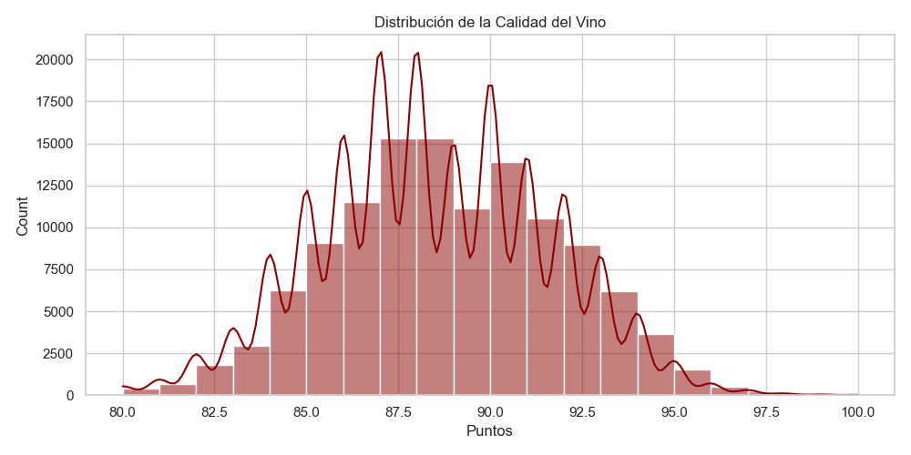
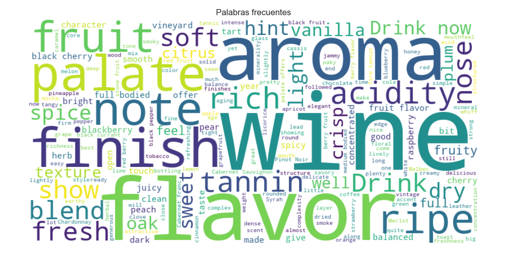

# 🍷 Wine Quality Predictor - NLP & Machine Learning

[](https://www.python.org/downloads/)
[](https://scikit-learn.org/)
[](https://www.nltk.org/)
[]()

> **Sistema inteligente de predicción de calidad de vinos mediante procesamiento de lenguaje natural (NLP) y redes neuronales.**

Predice la puntuación de calidad de un vino (escala 80-100) basándose únicamente en la descripción textual de sommeliers, con explicabilidad completa mediante LIME.

---

## 📋 Tabla de Contenidos

- [Características](#-características)
- [Estructura del Proyecto](#-estructura-del-proyecto)
- [Instalación](#-instalación)
- [Uso Rápido](#-uso-rápido)
- [Modelos Implementados](#-modelos-implementados)
- [Dataset](#-dataset)
- [Metodología](#-metodología)
- [Resultados](#-resultados)
- [Equipo](#-equipo)
- [Licencia](#-licencia)

---

## ✨ Características

- 🤖 **3 Modelos de ML Comparados**: Ridge Regression, Random Forest, MLP Neural Network
- 📊 **Análisis Exploratorio Completo**: Visualizaciones de distribución y nubes de palabras
- 🔍 **Explicabilidad con LIME**: Comprende qué palabras influyen en cada predicción
- 🖥️ **Interfaz Gráfica Moderna**: GUI profesional con CustomTkinter
- 📝 **Preprocesamiento NLP Avanzado**: Regex, Stopwords, Lematización
- 💾 **Modelos Persistentes**: Guarda y carga modelos entrenados
- ⚡ **Procesamiento Asíncrono**: UI responsiva con threading

---

## 📁 Estructura del Proyecto

```
ProyecAprAut/
├── 📂 src/                          # Código fuente
│   ├── models/                      # Scripts de entrenamiento
│   │   ├── train_basic.py          # Entrenamiento básico (3 modelos)
│   │   ├── train_with_metrics.py   # Con guardado de métricas
│   │   └── train_mlp_interactive.py # CLI interactivo (MLP)
│   ├── gui/                         # Interfaz gráfica
│   │   └── wine_predictor_gui.py   # Aplicación GUI principal
│   └── utils/                       # Utilidades (futuro)
│
├── 📂 data/                         # Datasets
│   ├── raw/                         # Datos originales
│   │   ├── winemag-data-130k-v2.csv      # 130k reseñas
│   │   ├── winemag-data-130k-v2.json     # Versión JSON
│   │   └── winemag-data_first150k.csv    # 150k reseñas
│   └── processed/                   # Datos procesados (generados)
│
├── 📂 docs/                         # Documentación
│   ├── INSTALACION.md              # Guía de instalación
│   ├── test_cases.txt              # Casos de prueba manuales
│   ├── images/                     # Imágenes de documentación
│   └── resultados/                 # Gráficos y resultados
│       ├── 1_distribucion_puntos.png
│       ├── 2_nube_palabras.png
│       ├── 3_comparacion_modelos.png
│       ├── explicacion_*.html
│       └── modelo_vino_entrenado.pkl
│
├── 📂 sistema_vino/                # Modelos entrenados
│   ├── cerebro_vino.pkl           # Modelo GUI
│   └── cerebro_vino_mlp.pkl       # Modelo MLP CLI
│
├── 📂 notebooks/                   # Jupyter Notebooks (futuro)
├── 📂 config/                      # Archivos de configuración
│
├── requirements.txt               # Dependencias Python
├── .gitignore                     # Archivos ignorados por Git
└── README.md                      # Este archivo
```

---

## 🚀 Instalación

### **Opción 1: Conda (Recomendado)**

```bash
# 1. Crear entorno virtual
conda create --name ProyeVino python=3.10 -y
conda activate ProyeVino

# 2. Instalar dependencias principales
conda install pandas numpy matplotlib seaborn scikit-learn nltk -y

# 3. Instalar dependencias adicionales
pip install lime wordcloud customtkinter packaging

# 4. Descargar recursos NLTK
python -c "import nltk; nltk.download('stopwords'); nltk.download('wordnet'); nltk.download('omw-1.4')"
```

### **Opción 2: pip**

```bash
# 1. Crear entorno virtual
python -m venv venv
source venv/bin/activate  # Windows: venv\Scripts\activate

# 2. Instalar dependencias
pip install -r requirements.txt

# 3. Descargar recursos NLTK
python -c "import nltk; nltk.download('stopwords'); nltk.download('wordnet'); nltk.download('omw-1.4')"
```

---

## 🎯 Uso Rápido

### **1. Interfaz Gráfica (GUI) - Recomendado**

```bash
python src/gui/wine_predictor_gui.py
```

**Características:**
- Pestañas de Predicción y Entrenamiento
- Resultados visuales con semáforo de colores
- Explicabilidad en tiempo real
- Ventana de ayuda integrada


### **2. CLI Interactivo (Consola)**

```bash
python src/models/train_mlp_interactive.py
```

**Opciones del menú:**
1. Entrenar modelo nuevo
2. Usar modelo existente (predicción interactiva)
3. Salir

### **3. Entrenamiento con Visualizaciones**

```bash
python src/models/train_with_metrics.py
```

Genera:
- ✅ Gráficos guardados en `docs/resultados/`
- ✅ Modelo entrenado en `.pkl`
- ✅ Explicaciones HTML

---

## 🧠 Modelos Implementados

| Modelo | Tipo | MAE (Error Promedio) | Velocidad | Ubicación |
|--------|------|----------------------|-----------|-----------|
| **Ridge Regression** | Lineal | ~1.50 puntos | ⚡ Muy rápido | `train_basic.py` |
| **Random Forest** | Ensamble | ~1.42 puntos | 🐢 Lento | `train_basic.py` |
| **MLP Neural Network** | Deep Learning | ~1.37 puntos ⭐ | ⚖️ Medio | `train_mlp_interactive.py` |

**🏆 Mejor Modelo:** MLP (Multilayer Perceptron) - Red neuronal con capas ocultas de 50 neuronas.

---

## 📊 Dataset

**Fuente:** Wine Magazine Reviews
**Tamaño:** 130,000 - 150,000 reseñas de vinos

**Columnas principales:**
- `description`: Texto descriptivo del sommelier (entrada del modelo)
- `points`: Puntuación 80-100 (objetivo a predecir)
- `country`, `variety`, `winery`: Metadatos

**Ejemplo:**
```
Descripción: "This wine is elegant, complex and has a rich finish."
Puntuación Real: 92 puntos
Predicción del Modelo: 91.5 puntos
```

---

## 🔬 Metodología

### **Pipeline de NLP**

1. **Limpieza de Texto:**
   - Conversión a minúsculas
   - Eliminación de símbolos especiales (regex)
   - Tokenización

2. **Preprocesamiento:**
   - Eliminación de stopwords (`the`, `is`, `and`, etc.)
   - Lematización (`running` → `run`, `wines` → `wine`)

3. **Vectorización:**
   - TF-IDF con 3000 features
   - Penaliza palabras comunes, prioriza únicas

4. **Entrenamiento:**
   - Split 80/20 (train/test)
   - Evaluación con MAE (Mean Absolute Error)

5. **Explicabilidad:**
   - LIME para interpretar predicciones
   - Identifica palabras clave positivas/negativas

### **Arquitectura MLP**

```
Input (3000 features TF-IDF)
    ↓
Hidden Layer 1 (50 neuronas)
    ↓
Hidden Layer 2 (50 neuronas)
    ↓
Output (1 neurona - puntaje)
```

---

## 📈 Resultados

### **Visualizaciones Generadas**

1. **Distribución de Puntuaciones:**
   

2. **Nube de Palabras:**
   

3. **Comparación de Modelos:**
   

### **Ejemplos de Predicciones**

**🟢 Alta Calidad (90+):**
```
Entrada: "This is truly elegant and complex with a rich finish."
Predicción: 93.2 puntos
Palabras clave: elegant (+0.48), complex (+0.42), rich (+0.35)
```

**🔴 Baja Calidad (80-85):**
```
Entrada: "This wine is flat, watery, and lacks character."
Predicción: 81.5 puntos
Palabras clave: flat (-0.52), watery (-0.38), lacks (-0.29)
```

---

## 👥 Equipo

**Proyecto Final - Aprendizaje Automático**

| Nombre | ID Estudiante |
|--------|---------------|
| Oscar Portela | 22507314 |
| Jorge Fong | 2205016 |
| Jhojan Alexander Calambas Ramirez | 2190555 |
| Angelo Parra Cortez | 22506988 |
| Juan Sebastian Rodriguez | 2195060 |

---

## 📝 Casos de Prueba

Consulta [docs/test_cases.txt](docs/test_cases.txt) para frases de prueba clasificadas por calidad esperada:

- 🟢 Alta calidad (90+): palabras como "elegant", "complex", "rich"
- 🟡 Calidad media (85-90): mezcla de características
- 🔴 Baja calidad (80-85): palabras como "flat", "bitter", "watery"

---

## 📚 Documentación Adicional

- [Guía de Instalación Detallada](docs/INSTALACION.md)
- [Explicaciones HTML de Predicciones](docs/resultados/)
- [Modelos Entrenados](sistema_vino/)

---

## 🔧 Tecnologías Utilizadas

- **Python 3.10+**
- **Machine Learning:** Scikit-Learn
- **NLP:** NLTK, TF-IDF
- **Explicabilidad:** LIME
- **Visualización:** Matplotlib, Seaborn, WordCloud
- **GUI:** CustomTkinter
- **Serialización:** Joblib

---

## 📄 Licencia

Proyecto académico desarrollado con fines educativos.

---

## 🤝 Contribuciones

Este es un proyecto académico finalizado. Para consultas o sugerencias, contactar al equipo de desarrollo.

---

## 📧 Contacto

Para más información sobre este proyecto, consulta la documentación en la carpeta [docs/](docs/).

---

**⭐ Si este proyecto te resulta útil, considera darle una estrella en GitHub!**

---

> *"El vino es poesía embotellada. La ciencia de datos es la llave para descifrarla."*
